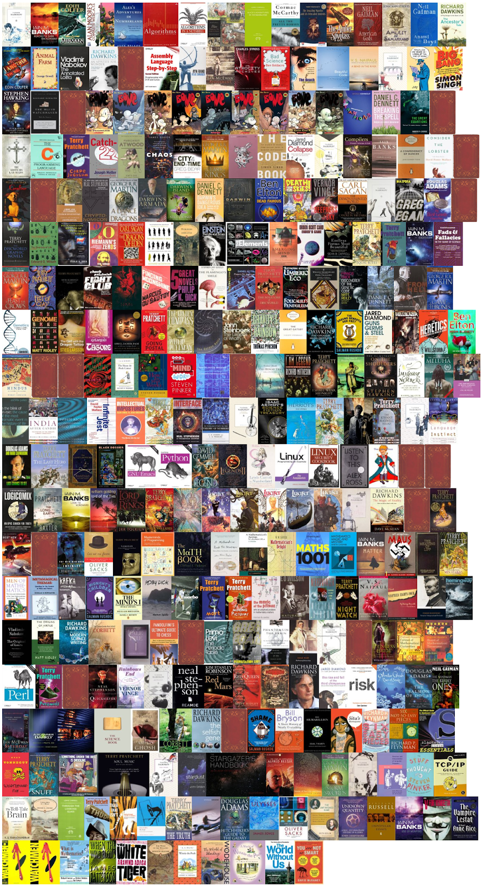

# 🐧About

I’m a software engineer in Bangalore who is addicted to [books](books/index.md). Classic
Literature ([Vladimir Nabokov](books/reviews/despair.md)), Popular Science ([Richard
Dawkins](heroes/dawkins.md)) and Science Fiction (Greg Egan) are the genres I prefer. The picture at the end of this page shows all the books I own, as of Feb 2015.

I seem to prefer breadth over depth, and enjoy playing games (mostly
on my [Xbox Series X](games/xbox.md) these days), fiddling with
GNU/Linux (~~Fedora~~, ~~MATE~~, WSL2 on windows,
[Emacs](notes/editors.md)) and [Python](notes/programming/python.md).

I have an adorable little daughter (Update Mar-2016 — and son!)

