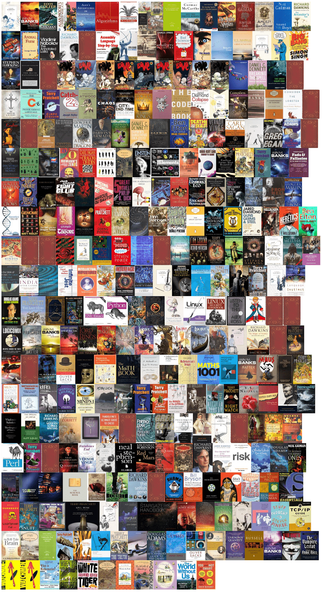

# 📖Books

## What I like

I mostly prefer Classic Literature these days. My favourite author is Vladimir Nabokov.

Among science fiction authors, I like hard sci-fi authors like Greg Egan and Peter Watts.

For non-fiction I like writers like Richard Dawkins and Noam Chomsky.

## What I've read

Here is a chronological list of books I've read, every month.

- [2025](2025.md)
- [2024](2024.md)
- [2023](2023.md)
- [2022](2022.md)
- [2021](2021.md)
- [2020](2020.md)
- [2019](2019.md)

## Favourite Books

Check my 'heroes' section for my favourite authors, such as:

- [Richard Dawkins](../archive/heroes/dawkins.md)
- [Carl Sagan](../archive/heroes/sagan.md)
- [Noam Chomsky](../archive/heroes/chomsky.md)

## 📖Books I own

This is not up to date and I've stowed most of them away. But it is a good
representation of my tastes.

